```mermaid
erDiagram
USERS {
bigint id PK
varchar email "UNIQUE"
varchar username
varchar profile_img
varchar role_global "ADMIN/USER 등"
datetime created_at
datetime updated_at
datetime last_login_at
boolean is_banned
}

    WORKSPACES {
        bigint id PK
        varchar name
        bigint owner_id FK
        datetime created_at
        datetime updated_at
    }

    WORKSPACE_MEMBERS {
        bigint workspace_id PK, FK
        bigint user_id PK, FK
        varchar role_in_workspace "OWNER/MEMBER"
        datetime joined_at
    }

    ROOMS {
        bigint id PK
        bigint workspace_id FK
        bigint host_id FK
        varchar title
        varchar visibility "PUBLIC/PRIVATE/TEAM"
        varchar password_hash
        varchar invite_policy "LINK/EMAIL/PASSWORD"
        boolean is_locked
        datetime created_at
        datetime updated_at
        datetime ended_at
    }

    ROOM_MEMBERS {
        bigint room_id PK, FK
        bigint user_id PK, FK
        varchar role_in_room "HOST/PRESENTER/MEMBER"
        datetime joined_at
        datetime last_seen_at
        boolean is_muted
        boolean hand_raised
    }

    ROOM_INVITES {
        bigint id PK
        bigint room_id FK
        bigint created_by FK
        varchar token "UNIQUE"
        varchar invite_type "LINK/EMAIL"
        varchar invite_email
        datetime expires_at
        int max_uses
        int used_count
        varchar default_role_in_room
        boolean is_revoked
        datetime created_at
    }

    CHAT_MESSAGES {
        bigint id PK
        bigint room_id FK
        bigint user_id FK
        varchar message_type "TEXT/FILE/IMAGE/BOARD_SNAPSHOT"
        text content
        bigint attachment_id FK
        bigint parent_id FK "thread/reply"
        boolean is_pinned
        datetime created_at
        datetime edited_at
        datetime deleted_at
    }

    ATTACHMENTS {
        bigint id PK
        bigint uploader_id FK
        varchar file_name
        varchar mime_type
        bigint file_size
        varchar storage_provider "S3/GCS/LOCAL"
        varchar storage_key
        varchar public_url
        datetime created_at
    }

    ROOM_EVENTS {
        bigint id PK
        bigint room_id FK
        bigint actor_id FK "nullable 가능"
        varchar event_type "JOIN/LEAVE/MUTE/KICK/REACTION/ROLE_CHANGE 등"
        json payload
        datetime created_at
    }

    NOTES {
        bigint room_id PK, FK
        text content
        bigint updated_by FK
        datetime updated_at
        int version
    }

    ACTION_ITEMS {
        bigint id PK
        bigint room_id FK
        bigint assignee_id FK
        varchar title
        text description
        date due_date
        varchar status "TODO/DOING/DONE"
        datetime created_at
        datetime updated_at
        datetime done_at
    }

    BOOKMARKS {
        bigint id PK
        bigint room_id FK
        bigint created_by FK
        varchar label
        int at_ms "회의 타임라인 기준"
        datetime created_at
    }

    WHITEBOARD_DOCS {
        bigint id PK
        bigint room_id FK
        varchar title
        int sort_order
        datetime created_at
        datetime updated_at
    }

    WHITEBOARD_PAGES {
        bigint id PK
        bigint doc_id FK
        int page_no
        varchar title
        datetime created_at
    }

    WHITEBOARD_SNAPSHOTS {
        bigint id PK
        bigint page_id FK
        int version
        json data_blob "excalidraw JSON or rendered state"
        bigint created_by FK
        datetime created_at
    }

    WHITEBOARD_UPDATES {
        bigint id PK
        bigint page_id FK
        bigint seq "정렬용"
        blob yjs_update "CRDT update (binary)"
        bigint created_by FK
        datetime created_at
    }

    POLLS {
        bigint id PK
        bigint room_id FK
        bigint created_by FK
        varchar question
        boolean is_anonymous
        datetime created_at
        datetime closed_at
    }

    POLL_OPTIONS {
        bigint id PK
        bigint poll_id FK
        varchar label
        int sort_order
    }

    POLL_VOTES {
        bigint poll_id PK, FK
        bigint option_id PK, FK
        bigint voter_id PK, FK "익명일 땐 nullable + device/session 키로 대체"
        datetime created_at
    }

    AUDIT_LOGS {
        bigint id PK
        bigint actor_id FK
        bigint workspace_id FK
        bigint room_id FK
        varchar action
        json metadata
        datetime created_at
        varchar ip
        varchar user_agent
    }

    REPORTS {
        bigint id PK
        bigint reporter_id FK
        varchar target_type "USER/ROOM/MESSAGE"
        bigint target_id
        varchar reason
        text detail
        varchar status "OPEN/IN_REVIEW/RESOLVED/REJECTED"
        datetime created_at
        datetime resolved_at
    }

    USERS ||--o{ WORKSPACES : owns
    USERS ||--o{ WORKSPACE_MEMBERS : joins
    WORKSPACES ||--o{ WORKSPACE_MEMBERS : has
    WORKSPACES ||--o{ ROOMS : contains
    USERS ||--o{ ROOMS : hosts

    ROOMS ||--o{ ROOM_MEMBERS : has
    USERS ||--o{ ROOM_MEMBERS : participates

    ROOMS ||--o{ ROOM_INVITES : issues
    USERS ||--o{ ROOM_INVITES : created_by

    ROOMS ||--o{ CHAT_MESSAGES : has
    USERS ||--o{ CHAT_MESSAGES : sends
    CHAT_MESSAGES ||--o{ CHAT_MESSAGES : replies
    ATTACHMENTS ||--o{ CHAT_MESSAGES : referenced
    USERS ||--o{ ATTACHMENTS : uploads

    ROOMS ||--o{ ROOM_EVENTS : emits
    USERS ||--o{ ROOM_EVENTS : acts

    ROOMS ||--|| NOTES : notes
    USERS ||--o{ NOTES : updates_by

    ROOMS ||--o{ ACTION_ITEMS : has
    USERS ||--o{ ACTION_ITEMS : assigned

    ROOMS ||--o{ BOOKMARKS : has
    USERS ||--o{ BOOKMARKS : creates

    ROOMS ||--o{ WHITEBOARD_DOCS : has
    WHITEBOARD_DOCS ||--o{ WHITEBOARD_PAGES : has
    WHITEBOARD_PAGES ||--o{ WHITEBOARD_SNAPSHOTS : snapshots
    WHITEBOARD_PAGES ||--o{ WHITEBOARD_UPDATES : updates
    USERS ||--o{ WHITEBOARD_SNAPSHOTS : creates
    USERS ||--o{ WHITEBOARD_UPDATES : creates

    ROOMS ||--o{ POLLS : has
    POLLS ||--o{ POLL_OPTIONS : options
    POLL_OPTIONS ||--o{ POLL_VOTES : votes
    USERS ||--o{ POLLS : creates
    USERS ||--o{ POLL_VOTES : votes

    USERS ||--o{ AUDIT_LOGS : actor
    WORKSPACES ||--o{ AUDIT_LOGS : workspace
    ROOMS ||--o{ AUDIT_LOGS : room

    USERS ||--o{ REPORTS : reporter
```

# MingleRoom ERD

## USERS

서비스 사용자 계정(전역 권한/프로필/제재 상태 포함)

- `id (PK)` : 유저 식별자(모든 FK가 이 값을 참조)
- `email (UNIQUE)` : 로그인 식별자(이메일 로그인/초대/멘션에서 사용)
- `username` : 화면 표시 닉네임(로비에서 설정 가능하게 할 거면 “기본값” 역할)
- `profile_img` : 프로필 이미지 URL/키(없으면 null)
- `role_global` : 전역 권한(예: USER, ADMIN) → 관리자 페이지 접근 등
- `created_at` : 가입 시각(감사/통계)
- `updated_at` : 프로필/권한 변경 시각
- `last_login_at` : 마지막 로그인 시각(보안/활동성 판단)
- `is_banned` : 계정 정지 여부(운영자가 차단하면 true)

---

## WORKSPACES

팀/조직 단위(팀 전용 룸, 프로젝트 룸 묶음)

- `id (PK)` : 워크스페이스 식별자
- `name` : 워크스페이스 이름(팀명/프로젝트명)
- `owner_id (FK -> users.id)` : 워크스페이스 소유자(관리 권한 기본값)
- `created_at` : 생성 시각
- `updated_at` : 이름 변경 등 갱신 시각

---

## WORKSPACE_MEMBERS

워크스페이스 멤버십(유저가 팀에 속해있는지 + 팀 권한)

- `workspace_id (PK, FK -> workspaces.id)` : 어떤 팀인지
- `user_id (PK, FK -> users.id)` : 어떤 유저인지
- `role_in_workspace` : 팀 내 권한(예: OWNER, MEMBER)
  - 팀 룸 생성권한, 팀 멤버 초대권한 같은 정책의 기준
- `joined_at` : 팀 가입 시각(감사/운영)

---

## ROOMS

회의/브레인스토밍이 열리는 “방(세션)”

- `id (PK)` : 룸 식별자(WS 토픽, REST 경로, 거의 모든 데이터의 기준)
- `workspace_id (FK -> workspaces.id)` : 팀 룸이면 채움 / 개인 룸이면 null 가능
- `host_id (FK -> users.id)` : “기본 호스트” 유저 id
  - 실제 권한은 `room_members.role_in_room` 기준으로 검사하는 걸 추천
- `title` : 룸 이름(회의명)
- `visibility` : 공개 범위
  - `PUBLIC`(링크만 알면 입장), `PRIVATE`(초대 필요), `TEAM`(워크스페이스 멤버만)
- `password_hash` : 비밀번호 입장일 때 저장(평문 금지, 해시로)
- `invite_policy` : 초대 방식 정책(예: LINK, EMAIL, PASSWORD, 혼합도 가능)
- `is_locked` : 방 잠금 상태(호스트가 잠금하면 true → 신규 입장 제한)
- `created_at` : 룸 생성 시각
- `updated_at` : 룸 설정 변경 시각(잠금/제목 변경 등)
- `ended_at` : 회의 종료 시각(끝난 회의 목록/요약 트리거 기준)

---

## ROOM_MEMBERS

룸 참가자 + 룸 내 권한/실시간 상태(가장 중요)

- `room_id (PK, FK -> rooms.id)` : 어느 방의 멤버인지
- `user_id (PK, FK -> users.id)` : 어떤 유저인지
- `role_in_room` : 룸 내 역할
  - `HOST`: 강퇴/잠금/강제 음소거/공지 고정/발표자 지정
  - `PRESENTER`: 발표자 핀/레이아웃 제어
  - `MEMBER`: 기본 기능
- `joined_at` : 룸 최초 입장 시각(회의 참석 기록)
- `last_seen_at` : 마지막 활동 시각(끊김 감지/자동 재연결 상태 판단)
- `is_muted` : 현재 음소거 상태(호스트 강제 음소거 포함)
- `hand_raised` : 손들기 상태(발언 큐 UI 구현)
  - (확장) 손든 시각을 기록하고 싶으면 `hand_raised_at` 추가 추천

---

## ROOM_INVITES

초대 링크/이메일 초대(만료/1회용/권한부여 포함)

- `id (PK)` : 초대 레코드 id
- `room_id (FK -> rooms.id)` : 어떤 룸 초대인지
- `created_by (FK -> users.id)` : 초대 만든 사람(보통 HOST/ADMIN)
- `token (UNIQUE)` : 초대 식별 토큰(링크에 포함)
- `invite_type` : `LINK` / `EMAIL`
- `invite_email` : 이메일 초대일 때 대상 이메일(링크 초대면 null)
- `expires_at` : 만료 시각(만료되면 입장 거부)
- `max_uses` : 최대 사용 가능 횟수(1회용이면 1)
- `used_count` : 현재까지 사용 횟수(입장 성공 시 +1)
- `default_role_in_room` : 이 초대로 들어온 유저에게 부여할 기본 역할(대부분 MEMBER)
- `is_revoked` : 초대 취소 여부(호스트가 폐기하면 true)
- `created_at` : 초대 생성 시각

---

## ATTACHMENTS

파일 업로드 메타데이터(실제 파일은 스토리지)

- `id (PK)` : 파일 메타 식별자
- `uploader_id (FK -> users.id)` : 업로드한 사람
- `file_name` : 원본 파일명(표시용)
- `mime_type` : 콘텐츠 타입(이미지/문서 구분, 보안 검증에도 필요)
- `file_size` : 용량(제한/과금/통계)
- `storage_provider` : 저장소 종류(S3, GCS, LOCAL 등)
- `storage_key` : 저장소 내부 키(경로/오브젝트 키)
- `public_url` : 접근 URL(공개 버킷이면) 또는 CDN URL
  - presigned URL이면 이 컬럼 대신 “다운로드 API”로 제공해도 됨
- `created_at` : 업로드 시각

---

## CHAT_MESSAGES

채팅 메시지(쓰레드/고정/파일 공유 포함)

- `id (PK)` : 메시지 id
- `room_id (FK -> rooms.id)` : 어떤 룸 채팅인지
- `user_id (FK -> users.id)` : 작성자
- `message_type` : `TEXT`, `FILE`, `IMAGE`, `BOARD_SNAPSHOT` 등
  - UI 렌더링/보안 정책 분기에 필요
- `content` : 텍스트 본문 또는 파일 설명/링크 등
  - 파일 메시지는 `attachment_id` + `content(캡션)` 구조가 보통
- `attachment_id (FK -> attachments.id)` : 파일/이미지 메시지의 실제 파일 연결
- `parent_id (FK -> chat_messages.id)` : 답장(쓰레드) 구현
  - 최상위는 null, 대댓글은 parent_id로 묶음
- `is_pinned` : 공지/고정 메시지 여부(상단 고정)
- `created_at` : 생성 시각(채팅 타임라인)
- `edited_at` : 수정 시각(“수정됨” 표시)
- `deleted_at` : 삭제 시각(하드 삭제 대신 “삭제됨” 처리)

---

## ROOM_EVENTS

룸 내 이벤트 로그(실시간 상태 + 기록 근거)

- `id (PK)` : 이벤트 id
- `room_id (FK -> rooms.id)` : 이벤트가 발생한 룸
- `actor_id (FK -> users.id, nullable)` : 행위자
  - 시스템 이벤트(자동 종료 등)면 null도 가능
- `event_type` : `JOIN`, `LEAVE`, `MUTE`, `KICK`, `ROLE_CHANGE`, `REACTION` 등
- `payload (JSON)` : 이벤트 상세(대상 user_id, emoji, 변경 전/후 역할 등)
- `created_at` : 발생 시각(리플레이/감사)

---

## NOTES

룸 공유 노트(회의록 공동 편집)

- `room_id (PK, FK -> rooms.id)` : 룸당 노트 1개(단순 구조)
- `content` : 노트 본문(마크다운/HTML 등)
- `updated_by (FK -> users.id)` : 마지막 편집자
- `updated_at` : 마지막 편집 시각
- `version` : 버전 번호(충돌 방지/낙관적 락 용도)

---

## ACTION_ITEMS

액션아이템(할 일/담당/기한/상태)

- `id (PK)` : 액션아이템 id
- `room_id (FK -> rooms.id)` : 어느 회의의 결과물인지
- `assignee_id (FK -> users.id)` : 담당자
- `title` : 할 일 제목(짧게)
- `description` : 상세 설명(옵션)
- `due_date` : 기한(알림/정렬/필터)
- `status` : `TODO` / `DOING` / `DONE`
- `created_at` : 생성 시각
- `updated_at` : 수정 시각
- `done_at` : 완료 처리 시각(성과/리드타임 통계)

---

## BOOKMARKS

타임스탬프 북마크(중요 순간 저장)

- `id (PK)` : 북마크 id
- `room_id (FK -> rooms.id)` : 어느 룸인지
- `created_by (FK -> users.id)` : 북마크 만든 사람
- `label` : 제목(“결정사항”, “이슈 발생” 등)
- `at_ms` : 회의 타임라인 기준 시각(ms)
  - 실제 녹음/녹화가 없더라도 “회의 시작 기준 상대시간”으로 유용
- `created_at` : 생성 시각

---

## WHITEBOARD_DOCS

화이트보드 문서(보드 묶음)

- `id (PK)` : 문서 id
- `room_id (FK -> rooms.id)` : 어느 룸의 보드인지
- `title` : 보드 제목(“브레인스토밍”, “칸반”)
- `sort_order` : 보드 탭 정렬 순서
- `created_at` : 생성 시각
- `updated_at` : 제목 변경 등 갱신 시각

---

## WHITEBOARD_PAGES

화이트보드 페이지(여러 장)

- `id (PK)` : 페이지 id
- `doc_id (FK -> whiteboard_docs.id)` : 어떤 보드 문서의 페이지인지
- `page_no` : 페이지 번호(1,2,3…)
- `title` : 페이지 제목(옵션)
- `created_at` : 생성 시각

---

## WHITEBOARD_SNAPSHOTS

보드 스냅샷(전체 상태 저장, 복구/내보내기용)

- `id (PK)` : 스냅샷 id
- `page_id (FK -> whiteboard_pages.id)` : 어느 페이지 스냅샷인지
- `version` : 스냅샷 버전(증가)
- `data_blob (JSON)` : Excalidraw 요소/상태 전체(JSON)
- `created_by (FK -> users.id)` : 생성한 사람(자동 저장이면 시스템 사용자 처리 가능)
- `created_at` : 생성 시각

---

## WHITEBOARD_UPDATES

CRDT 업데이트 로그(Yjs update 저장)

- `id (PK)` : 업데이트 id
- `page_id (FK -> whiteboard_pages.id)` : 어느 페이지 업데이트인지
- `seq` : 증가하는 순번(리플레이/정렬 핵심)
- `yjs_update (BLOB)` : Yjs binary update 데이터
- `created_by (FK -> users.id)` : 업데이트 만든 사람(실시간 편집자)
- `created_at` : 생성 시각

---

## POLLS

투표/설문

- `id (PK)` : 투표 id
- `room_id (FK -> rooms.id)` : 어느 룸에서 진행됐는지
- `created_by (FK -> users.id)` : 만든 사람(보통 HOST)
- `question` : 질문
- `is_anonymous` : 익명 여부(true면 투표자 식별을 제한)
- `created_at` : 생성 시각
- `closed_at` : 종료 시각(종료 후 투표 막기)

---

## POLL_OPTIONS

투표 항목

- `id (PK)` : 옵션 id
- `poll_id (FK -> polls.id)` : 어떤 투표의 옵션인지
- `label` : 보기 텍스트(A/B/C 또는 문장)
- `sort_order` : 표시 순서

---

## POLL_VOTES

투표 기록(누가 어떤 옵션에 투표했는지)

- `poll_id (PK, FK -> polls.id)` : 어떤 투표인지
- `option_id (PK, FK -> poll_options.id)` : 어떤 보기인지
- `voter_id (PK, FK -> users.id, nullable 가능)` : 투표자
  - 익명 투표면 이걸 null로 두고 `voter_session_key` 같은 걸 추가하는 게 안전함
- `created_at` : 투표 시각

---

## AUDIT_LOGS

감사 로그(운영/보안/분쟁 처리용)

- `id (PK)` : 감사 로그 id
- `actor_id (FK -> users.id)` : 누가 했는지(관리자/호스트)
- `workspace_id (FK -> workspaces.id, nullable)` : 워크스페이스 단위 행위면 저장
- `room_id (FK -> rooms.id, nullable)` : 룸 단위 행위면 저장
- `action` : 행위 코드(예: ROOM_LOCK, USER_KICK, REPORT_RESOLVE)
- `metadata (JSON)` : 상세 정보(대상 user_id, 변경 전/후 값 등)
- `created_at` : 발생 시각
- `ip` : 요청 IP(보안 감사)
- `user_agent` : 브라우저/클라이언트 정보(분쟁/보안)

---

## REPORTS

신고(유저/룸/메시지 대상)

- `id (PK)` : 신고 id
- `reporter_id (FK -> users.id)` : 신고자
- `target_type` : `USER` / `ROOM` / `MESSAGE`
- `target_id` : 대상 id(폴리모픽이라 FK 제약은 보통 서비스단에서 검증)
- `reason` : 사유 코드(스팸/욕설/부적절 콘텐츠 등)
- `detail` : 상세 설명(사용자 서술)
- `status` : 처리 상태(`OPEN`, `IN_REVIEW`, `RESOLVED`, `REJECTED`)
- `created_at` : 신고 시각
- `resolved_at` : 처리 완료 시각

---

# 테이블 생성 쿼리문

```sql
-- =========================
-- PostgreSQL DDL (ERD 기준)
-- =========================
-- 권장: UTF-8 기본, timezone은 DB/세션에서 설정
-- ALTER DATABASE yourdb SET timezone TO 'Asia/Seoul';

-- (선택) UUID/암호화/토큰 생성 등에 쓰고 싶으면
-- CREATE EXTENSION IF NOT EXISTS pgcrypto;

-- =========================
-- 0) ENUM 타입들
-- =========================
DO $$ BEGIN
  CREATE TYPE role_global_t        AS ENUM ('USER','ADMIN');
EXCEPTION WHEN duplicate_object THEN NULL; END $$;

DO $$ BEGIN
  CREATE TYPE workspace_role_t     AS ENUM ('OWNER','MEMBER');
EXCEPTION WHEN duplicate_object THEN NULL; END $$;

DO $$ BEGIN
  CREATE TYPE room_visibility_t    AS ENUM ('PUBLIC','PRIVATE','TEAM');
EXCEPTION WHEN duplicate_object THEN NULL; END $$;

DO $$ BEGIN
  CREATE TYPE invite_policy_t      AS ENUM ('LINK','EMAIL','PASSWORD','MIXED');
EXCEPTION WHEN duplicate_object THEN NULL; END $$;

DO $$ BEGIN
  CREATE TYPE room_role_t          AS ENUM ('HOST','PRESENTER','MEMBER');
EXCEPTION WHEN duplicate_object THEN NULL; END $$;

DO $$ BEGIN
  CREATE TYPE invite_type_t        AS ENUM ('LINK','EMAIL');
EXCEPTION WHEN duplicate_object THEN NULL; END $$;

DO $$ BEGIN
  CREATE TYPE message_type_t       AS ENUM ('TEXT','FILE','IMAGE','BOARD_SNAPSHOT');
EXCEPTION WHEN duplicate_object THEN NULL; END $$;

DO $$ BEGIN
  CREATE TYPE room_event_type_t    AS ENUM ('JOIN','LEAVE','MUTE','KICK','ROLE_CHANGE','HAND_UP','REACTION','NOTICE_PIN','NOTICE_UNPIN');
EXCEPTION WHEN duplicate_object THEN NULL; END $$;

DO $$ BEGIN
  CREATE TYPE action_status_t      AS ENUM ('TODO','DOING','DONE');
EXCEPTION WHEN duplicate_object THEN NULL; END $$;

DO $$ BEGIN
  CREATE TYPE storage_provider_t   AS ENUM ('S3','GCS','LOCAL');
EXCEPTION WHEN duplicate_object THEN NULL; END $$;

DO $$ BEGIN
  CREATE TYPE report_target_type_t AS ENUM ('USER','ROOM','MESSAGE');
EXCEPTION WHEN duplicate_object THEN NULL; END $$;

DO $$ BEGIN
  CREATE TYPE report_status_t      AS ENUM ('OPEN','IN_REVIEW','RESOLVED','REJECTED');
EXCEPTION WHEN duplicate_object THEN NULL; END $$;

-- =========================
-- 1) TABLES
-- =========================

-- USERS
-- ============================================================
-- MingleRoom PostgreSQL DDL (Clean, with constraints & triggers)
-- - Nickname duplicate allowed: users.username is NOT unique
-- - Email unique: case-insensitive via CITEXT (recommended)
-- - updated_at auto update triggers
-- - password_updated_at auto update trigger
-- - integrity CHECK constraints for rooms / invites / votes
-- ============================================================

-- (선택) DB timezone
-- ALTER DATABASE yourdb SET timezone TO 'Asia/Seoul';

-- 0) Extensions
CREATE EXTENSION IF NOT EXISTS citext;
-- (선택) 토큰/UUID 생성에 쓸 거면
-- CREATE EXTENSION IF NOT EXISTS pgcrypto;

-- ============================================================
-- 1) ENUM TYPES
-- ============================================================
DO $$ BEGIN
  CREATE TYPE role_global_t AS ENUM ('USER','ADMIN');
EXCEPTION WHEN duplicate_object THEN NULL; END $$;

DO $$ BEGIN
  CREATE TYPE workspace_role_t AS ENUM ('OWNER','MEMBER');
EXCEPTION WHEN duplicate_object THEN NULL; END $$;

DO $$ BEGIN
  CREATE TYPE room_visibility_t AS ENUM ('PUBLIC','PRIVATE','TEAM');
EXCEPTION WHEN duplicate_object THEN NULL; END $$;

DO $$ BEGIN
  CREATE TYPE invite_policy_t AS ENUM ('LINK','EMAIL','PASSWORD','MIXED');
EXCEPTION WHEN duplicate_object THEN NULL; END $$;

DO $$ BEGIN
  CREATE TYPE room_role_t AS ENUM ('HOST','PRESENTER','MEMBER');
EXCEPTION WHEN duplicate_object THEN NULL; END $$;

DO $$ BEGIN
  CREATE TYPE invite_type_t AS ENUM ('LINK','EMAIL');
EXCEPTION WHEN duplicate_object THEN NULL; END $$;

DO $$ BEGIN
  CREATE TYPE message_type_t AS ENUM ('TEXT','FILE','IMAGE','BOARD_SNAPSHOT', 'SYSTEM');
EXCEPTION WHEN duplicate_object THEN NULL; END $$;

DO $$ BEGIN
  CREATE TYPE room_event_type_t AS ENUM ('JOIN','LEAVE','MUTE','KICK','ROLE_CHANGE','HAND_UP','REACTION','NOTICE_PIN','NOTICE_UNPIN');
EXCEPTION WHEN duplicate_object THEN NULL; END $$;

DO $$ BEGIN
  CREATE TYPE action_status_t AS ENUM ('TODO','DOING','DONE');
EXCEPTION WHEN duplicate_object THEN NULL; END $$;

DO $$ BEGIN
  CREATE TYPE storage_provider_t AS ENUM ('S3','GCS','LOCAL');
EXCEPTION WHEN duplicate_object THEN NULL; END $$;

DO $$ BEGIN
  CREATE TYPE report_target_type_t AS ENUM ('USER','ROOM','MESSAGE');
EXCEPTION WHEN duplicate_object THEN NULL; END $$;

DO $$ BEGIN
  CREATE TYPE report_status_t AS ENUM ('OPEN','IN_REVIEW','RESOLVED','REJECTED');
EXCEPTION WHEN duplicate_object THEN NULL; END $$;

-- ============================================================
-- 2) TRIGGERS FUNCTIONS
-- ============================================================
CREATE OR REPLACE FUNCTION set_updated_at()
RETURNS trigger AS $$
BEGIN
  NEW.updated_at = now();
  RETURN NEW;
END;
$$ LANGUAGE plpgsql;

CREATE OR REPLACE FUNCTION set_password_updated_at()
RETURNS trigger AS $$
BEGIN
  IF NEW.password_hash IS DISTINCT FROM OLD.password_hash THEN
    NEW.password_updated_at = now();
  END IF;
  RETURN NEW;
END;
$$ LANGUAGE plpgsql;

-- ============================================================
-- 3) TABLES
-- ============================================================

-- USERS (email: CITEXT for case-insensitive unique)
CREATE TABLE IF NOT EXISTS users (
  id                  BIGINT GENERATED ALWAYS AS IDENTITY PRIMARY KEY,
  email               CITEXT NOT NULL UNIQUE,
  username            VARCHAR(50) NOT NULL,      -- nickname (duplicate allowed)
  profile_img         VARCHAR(1024),

  password_hash       TEXT NOT NULL,             -- store hash only (bcrypt/argon2)
  role_global         role_global_t NOT NULL DEFAULT 'USER',
  is_banned           BOOLEAN NOT NULL DEFAULT FALSE,

  created_at          TIMESTAMPTZ NOT NULL DEFAULT now(),
  updated_at          TIMESTAMPTZ NOT NULL DEFAULT now(),
  password_updated_at TIMESTAMPTZ NOT NULL DEFAULT now(),
  last_login_at       TIMESTAMPTZ
);

CREATE INDEX IF NOT EXISTS idx_users_username ON users(username);

DO $$ BEGIN
  CREATE TRIGGER trg_users_updated_at
  BEFORE UPDATE ON users
  FOR EACH ROW EXECUTE FUNCTION set_updated_at();
EXCEPTION WHEN duplicate_object THEN NULL; END $$;

DO $$ BEGIN
  CREATE TRIGGER trg_users_password_updated_at
  BEFORE UPDATE ON users
  FOR EACH ROW EXECUTE FUNCTION set_password_updated_at();
EXCEPTION WHEN duplicate_object THEN NULL; END $$;


-- REFRESHTOKEN
create table refresh_tokens (
  id bigserial primary key,
  user_id bigint not null references users(id) on delete cascade,
  token_hash varchar(64) not null unique,     -- sha256 hex (64 chars)
  expires_at timestamptz not null,
  revoked_at timestamptz null,
  created_at timestamptz not null default now()
);

create index idx_refresh_tokens_user_id on refresh_tokens(user_id);

-- WORKSPACES
CREATE TABLE IF NOT EXISTS workspaces (
  id         BIGINT GENERATED ALWAYS AS IDENTITY PRIMARY KEY,
  name       VARCHAR(100) NOT NULL,
  owner_id   BIGINT NOT NULL REFERENCES users(id) ON DELETE RESTRICT,

  created_at TIMESTAMPTZ NOT NULL DEFAULT now(),
  updated_at TIMESTAMPTZ NOT NULL DEFAULT now()
);

CREATE INDEX IF NOT EXISTS idx_workspaces_owner ON workspaces(owner_id);

DO $$ BEGIN
  CREATE TRIGGER trg_workspaces_updated_at
  BEFORE UPDATE ON workspaces
  FOR EACH ROW EXECUTE FUNCTION set_updated_at();
EXCEPTION WHEN duplicate_object THEN NULL; END $$;

-- WORKSPACE_MEMBERS
CREATE TABLE IF NOT EXISTS workspace_members (
  workspace_id      BIGINT NOT NULL REFERENCES workspaces(id) ON DELETE CASCADE,
  user_id           BIGINT NOT NULL REFERENCES users(id) ON DELETE RESTRICT,
  role_in_workspace workspace_role_t NOT NULL DEFAULT 'MEMBER',
  joined_at         TIMESTAMPTZ NOT NULL DEFAULT now(),

  PRIMARY KEY (workspace_id, user_id)
);

CREATE INDEX IF NOT EXISTS idx_ws_members_user ON workspace_members(user_id);

-- ROOMS
CREATE TABLE IF NOT EXISTS rooms (
  id                  BIGINT GENERATED ALWAYS AS IDENTITY PRIMARY KEY,
  workspace_id        BIGINT REFERENCES workspaces(id) ON DELETE SET NULL,
  host_id             BIGINT NOT NULL REFERENCES users(id) ON DELETE RESTRICT,

  title               VARCHAR(150) NOT NULL,
  visibility          room_visibility_t NOT NULL DEFAULT 'PRIVATE',

  -- 룸 비밀번호(입장 정책이 PASSWORD/MIXED일 때 사용)
  room_password_hash  VARCHAR(255),

  invite_policy       invite_policy_t NOT NULL DEFAULT 'LINK',
  is_locked           BOOLEAN NOT NULL DEFAULT FALSE,

  created_at          TIMESTAMPTZ NOT NULL DEFAULT now(),
  updated_at          TIMESTAMPTZ NOT NULL DEFAULT now(),
  ended_at            TIMESTAMPTZ,

  -- 무결성 체크
  CONSTRAINT ck_rooms_team_requires_workspace
    CHECK (visibility <> 'TEAM' OR workspace_id IS NOT NULL),

  CONSTRAINT ck_rooms_password_policy_requires_hash
    CHECK (invite_policy <> 'PASSWORD' OR room_password_hash IS NOT NULL)
);

CREATE INDEX IF NOT EXISTS idx_rooms_workspace ON rooms(workspace_id);
CREATE INDEX IF NOT EXISTS idx_rooms_host      ON rooms(host_id);
CREATE INDEX IF NOT EXISTS idx_rooms_created   ON rooms(created_at);

DO $$ BEGIN
  CREATE TRIGGER trg_rooms_updated_at
  BEFORE UPDATE ON rooms
  FOR EACH ROW EXECUTE FUNCTION set_updated_at();
EXCEPTION WHEN duplicate_object THEN NULL; END $$;

-- ROOM_MEMBERS
CREATE TABLE IF NOT EXISTS room_members (
  room_id      BIGINT NOT NULL REFERENCES rooms(id) ON DELETE CASCADE,
  user_id      BIGINT NOT NULL REFERENCES users(id) ON DELETE RESTRICT,

  role_in_room room_role_t NOT NULL DEFAULT 'MEMBER',

  joined_at    TIMESTAMPTZ NOT NULL DEFAULT now(),
  last_seen_at TIMESTAMPTZ,

  is_muted     BOOLEAN NOT NULL DEFAULT FALSE,
  hand_raised  BOOLEAN NOT NULL DEFAULT FALSE,

  PRIMARY KEY (room_id, user_id)
);

CREATE INDEX IF NOT EXISTS idx_room_members_user      ON room_members(user_id);
CREATE INDEX IF NOT EXISTS idx_room_members_last_seen ON room_members(room_id, last_seen_at);

-- ROOM_INVITES
CREATE TABLE IF NOT EXISTS room_invites (
  id                   BIGINT GENERATED ALWAYS AS IDENTITY PRIMARY KEY,
  room_id              BIGINT NOT NULL REFERENCES rooms(id) ON DELETE CASCADE,
  created_by           BIGINT REFERENCES users(id) ON DELETE SET NULL,

  token                VARCHAR(128) NOT NULL UNIQUE,
  invite_type          invite_type_t NOT NULL DEFAULT 'LINK',
  invite_email         VARCHAR(255),

  expires_at           TIMESTAMPTZ,
  max_uses             INTEGER NOT NULL DEFAULT 1 CHECK (max_uses >= 1),
  used_count           INTEGER NOT NULL DEFAULT 0 CHECK (used_count >= 0),

  default_role_in_room room_role_t NOT NULL DEFAULT 'MEMBER',
  is_revoked           BOOLEAN NOT NULL DEFAULT FALSE,

  created_at           TIMESTAMPTZ NOT NULL DEFAULT now(),

  -- 무결성 체크: 이메일 초대면 이메일 필수 / 링크면 NULL 권장
  CONSTRAINT ck_room_invites_email_requires_invite_email
    CHECK (
      (invite_type = 'EMAIL' AND invite_email IS NOT NULL)
      OR
      (invite_type = 'LINK' AND invite_email IS NULL)
    )
);

CREATE INDEX IF NOT EXISTS idx_room_invites_room    ON room_invites(room_id);
CREATE INDEX IF NOT EXISTS idx_room_invites_expires ON room_invites(expires_at);

-- ATTACHMENTS
CREATE TABLE IF NOT EXISTS attachments (
  id               BIGINT GENERATED ALWAYS AS IDENTITY PRIMARY KEY,
  uploader_id      BIGINT REFERENCES users(id) ON DELETE SET NULL,

  file_name        VARCHAR(255) NOT NULL,
  mime_type        VARCHAR(100) NOT NULL,
  file_size        BIGINT NOT NULL CHECK (file_size >= 0),

  storage_provider storage_provider_t NOT NULL DEFAULT 'S3',
  storage_key      VARCHAR(512) NOT NULL,
  public_url       VARCHAR(1024),

  created_at       TIMESTAMPTZ NOT NULL DEFAULT now()
);

CREATE INDEX IF NOT EXISTS idx_attachments_uploader ON attachments(uploader_id);
CREATE INDEX IF NOT EXISTS idx_attachments_created  ON attachments(created_at);

-- CHAT_MESSAGES
CREATE TABLE IF NOT EXISTS chat_messages (
  id            BIGINT GENERATED ALWAYS AS IDENTITY PRIMARY KEY,
  room_id       BIGINT NOT NULL REFERENCES rooms(id) ON DELETE CASCADE,
  user_id       BIGINT NOT NULL REFERENCES users(id) ON DELETE RESTRICT,

  message_type  message_type_t NOT NULL DEFAULT 'TEXT',
  content       TEXT,

  attachment_id BIGINT REFERENCES attachments(id) ON DELETE SET NULL,
  parent_id     BIGINT REFERENCES chat_messages(id) ON DELETE SET NULL,

  is_pinned     BOOLEAN NOT NULL DEFAULT FALSE,

  created_at    TIMESTAMPTZ NOT NULL DEFAULT now(),
  edited_at     TIMESTAMPTZ,
  deleted_at    TIMESTAMPTZ
);

CREATE INDEX IF NOT EXISTS idx_chat_room_time   ON chat_messages(room_id, created_at);
CREATE INDEX IF NOT EXISTS idx_chat_room_parent ON chat_messages(room_id, parent_id);
CREATE INDEX IF NOT EXISTS idx_chat_user_time   ON chat_messages(user_id, created_at);

-- ROOM_EVENTS
CREATE TABLE IF NOT EXISTS room_events (
  id         BIGINT GENERATED ALWAYS AS IDENTITY PRIMARY KEY,
  room_id    BIGINT NOT NULL REFERENCES rooms(id) ON DELETE CASCADE,
  actor_id   BIGINT REFERENCES users(id) ON DELETE SET NULL,

  event_type room_event_type_t NOT NULL,
  payload    JSONB,

  created_at TIMESTAMPTZ NOT NULL DEFAULT now()
);

CREATE INDEX IF NOT EXISTS idx_room_events_room_time ON room_events(room_id, created_at);

-- NOTES (room 1:1)
CREATE TABLE IF NOT EXISTS notes (
  room_id    BIGINT PRIMARY KEY REFERENCES rooms(id) ON DELETE CASCADE,
  content    TEXT NOT NULL,
  updated_by BIGINT REFERENCES users(id) ON DELETE SET NULL,
  updated_at TIMESTAMPTZ NOT NULL DEFAULT now(),
  version    INTEGER NOT NULL DEFAULT 1 CHECK (version >= 1)
);

-- ACTION_ITEMS
CREATE TABLE IF NOT EXISTS action_items (
  id          BIGINT GENERATED ALWAYS AS IDENTITY PRIMARY KEY,
  room_id     BIGINT NOT NULL REFERENCES rooms(id) ON DELETE CASCADE,
  assignee_id BIGINT REFERENCES users(id) ON DELETE SET NULL,

  title       VARCHAR(200) NOT NULL,
  description TEXT,

  due_date    DATE,
  status      action_status_t NOT NULL DEFAULT 'TODO',

  created_at  TIMESTAMPTZ NOT NULL DEFAULT now(),
  updated_at  TIMESTAMPTZ NOT NULL DEFAULT now(),
  done_at     TIMESTAMPTZ
);

CREATE INDEX IF NOT EXISTS idx_action_room_status ON action_items(room_id, status);
CREATE INDEX IF NOT EXISTS idx_action_assignee    ON action_items(assignee_id);
CREATE INDEX IF NOT EXISTS idx_action_due         ON action_items(due_date);

DO $$ BEGIN
  CREATE TRIGGER trg_action_items_updated_at
  BEFORE UPDATE ON action_items
  FOR EACH ROW EXECUTE FUNCTION set_updated_at();
EXCEPTION WHEN duplicate_object THEN NULL; END $$;

-- BOOKMARKS
CREATE TABLE IF NOT EXISTS bookmarks (
  id         BIGINT GENERATED ALWAYS AS IDENTITY PRIMARY KEY,
  room_id    BIGINT NOT NULL REFERENCES rooms(id) ON DELETE CASCADE,
  created_by BIGINT REFERENCES users(id) ON DELETE SET NULL,

  label      VARCHAR(120) NOT NULL,
  at_ms      INTEGER NOT NULL CHECK (at_ms >= 0),

  created_at TIMESTAMPTZ NOT NULL DEFAULT now()
);

CREATE INDEX IF NOT EXISTS idx_bookmarks_room_time ON bookmarks(room_id, created_at);

-- WHITEBOARD_DOCS
CREATE TABLE IF NOT EXISTS whiteboard_docs (
  id         BIGINT GENERATED ALWAYS AS IDENTITY PRIMARY KEY,
  room_id    BIGINT NOT NULL REFERENCES rooms(id) ON DELETE CASCADE,

  title      VARCHAR(150) NOT NULL,
  sort_order INTEGER NOT NULL DEFAULT 0 CHECK (sort_order >= 0),

  created_at TIMESTAMPTZ NOT NULL DEFAULT now(),
  updated_at TIMESTAMPTZ NOT NULL DEFAULT now()
);

CREATE INDEX IF NOT EXISTS idx_wbd_room_sort ON whiteboard_docs(room_id, sort_order);

DO $$ BEGIN
  CREATE TRIGGER trg_whiteboard_docs_updated_at
  BEFORE UPDATE ON whiteboard_docs
  FOR EACH ROW EXECUTE FUNCTION set_updated_at();
EXCEPTION WHEN duplicate_object THEN NULL; END $$;

-- WHITEBOARD_PAGES
CREATE TABLE IF NOT EXISTS whiteboard_pages (
  id         BIGINT GENERATED ALWAYS AS IDENTITY PRIMARY KEY,
  doc_id     BIGINT NOT NULL REFERENCES whiteboard_docs(id) ON DELETE CASCADE,

  page_no    INTEGER NOT NULL CHECK (page_no >= 1),
  title      VARCHAR(150),

  created_at TIMESTAMPTZ NOT NULL DEFAULT now(),

  UNIQUE (doc_id, page_no)
);

CREATE INDEX IF NOT EXISTS idx_wbp_doc ON whiteboard_pages(doc_id);

-- WHITEBOARD_SNAPSHOTS
CREATE TABLE IF NOT EXISTS whiteboard_snapshots (
  id         BIGINT GENERATED ALWAYS AS IDENTITY PRIMARY KEY,
  page_id    BIGINT NOT NULL REFERENCES whiteboard_pages(id) ON DELETE CASCADE,

  version    INTEGER NOT NULL CHECK (version >= 1),
  data_blob  JSONB NOT NULL,

  created_by BIGINT REFERENCES users(id) ON DELETE SET NULL,
  created_at TIMESTAMPTZ NOT NULL DEFAULT now(),

  UNIQUE (page_id, version)
);

CREATE INDEX IF NOT EXISTS idx_wbs_page_time ON whiteboard_snapshots(page_id, created_at);

-- WHITEBOARD_UPDATES
CREATE TABLE IF NOT EXISTS whiteboard_updates (
  id         BIGINT GENERATED ALWAYS AS IDENTITY PRIMARY KEY,
  page_id    BIGINT NOT NULL REFERENCES whiteboard_pages(id) ON DELETE CASCADE,

  seq        BIGINT NOT NULL CHECK (seq >= 0),
  yjs_update BYTEA  NOT NULL,

  created_by BIGINT REFERENCES users(id) ON DELETE SET NULL,
  created_at TIMESTAMPTZ NOT NULL DEFAULT now(),

  UNIQUE (page_id, seq)
);

CREATE INDEX IF NOT EXISTS idx_wbu_page_time ON whiteboard_updates(page_id, created_at);

-- POLLS
CREATE TABLE IF NOT EXISTS polls (
  id           BIGINT GENERATED ALWAYS AS IDENTITY PRIMARY KEY,
  room_id      BIGINT NOT NULL REFERENCES rooms(id) ON DELETE CASCADE,
  created_by   BIGINT REFERENCES users(id) ON DELETE SET NULL,

  question     VARCHAR(255) NOT NULL,
  is_anonymous BOOLEAN NOT NULL DEFAULT FALSE,

  created_at   TIMESTAMPTZ NOT NULL DEFAULT now(),
  closed_at    TIMESTAMPTZ
);

CREATE INDEX IF NOT EXISTS idx_polls_room_time ON polls(room_id, created_at);

-- POLL_OPTIONS
CREATE TABLE IF NOT EXISTS poll_options (
  id         BIGINT GENERATED ALWAYS AS IDENTITY PRIMARY KEY,
  poll_id    BIGINT NOT NULL REFERENCES polls(id) ON DELETE CASCADE,

  label      VARCHAR(150) NOT NULL,
  sort_order INTEGER NOT NULL DEFAULT 0 CHECK (sort_order >= 0),

  UNIQUE (poll_id, sort_order)
);

CREATE INDEX IF NOT EXISTS idx_poll_options_poll ON poll_options(poll_id);

-- POLL_VOTES
CREATE TABLE IF NOT EXISTS poll_votes (
  id                BIGINT GENERATED ALWAYS AS IDENTITY PRIMARY KEY,
  poll_id           BIGINT NOT NULL REFERENCES polls(id) ON DELETE CASCADE,
  option_id         BIGINT NOT NULL REFERENCES poll_options(id) ON DELETE CASCADE,

  voter_id          BIGINT REFERENCES users(id) ON DELETE SET NULL,
  voter_session_key VARCHAR(64),

  voter_key TEXT GENERATED ALWAYS AS (
    CASE
      WHEN voter_id IS NOT NULL THEN ('U:' || voter_id::text)
      ELSE ('S:' || voter_session_key)
    END
  ) STORED,

  created_at TIMESTAMPTZ NOT NULL DEFAULT now(),

  CONSTRAINT ck_poll_votes_voter_xor
    CHECK (
      (voter_id IS NOT NULL AND voter_session_key IS NULL)
      OR
      (voter_id IS NULL AND voter_session_key IS NOT NULL)
    )
);

CREATE UNIQUE INDEX IF NOT EXISTS uq_poll_votes_one_per_voter
  ON poll_votes(poll_id, voter_key);

CREATE INDEX IF NOT EXISTS idx_poll_votes_option ON poll_votes(option_id);

-- AUDIT_LOGS
CREATE TABLE IF NOT EXISTS audit_logs (
  id           BIGINT GENERATED ALWAYS AS IDENTITY PRIMARY KEY,
  actor_id     BIGINT REFERENCES users(id)      ON DELETE SET NULL,
  workspace_id BIGINT REFERENCES workspaces(id) ON DELETE SET NULL,
  room_id      BIGINT REFERENCES rooms(id)      ON DELETE SET NULL,

  action       VARCHAR(80) NOT NULL,
  metadata     JSONB,

  ip           VARCHAR(64),
  user_agent   VARCHAR(255),

  created_at   TIMESTAMPTZ NOT NULL DEFAULT now()
);

CREATE INDEX IF NOT EXISTS idx_audit_workspace_time ON audit_logs(workspace_id, created_at);
CREATE INDEX IF NOT EXISTS idx_audit_room_time      ON audit_logs(room_id, created_at);
CREATE INDEX IF NOT EXISTS idx_audit_actor_time     ON audit_logs(actor_id, created_at);

-- REPORTS
CREATE TABLE IF NOT EXISTS reports (
  id          BIGINT GENERATED ALWAYS AS IDENTITY PRIMARY KEY,
  reporter_id BIGINT REFERENCES users(id) ON DELETE SET NULL,

  target_type report_target_type_t NOT NULL,
  target_id   BIGINT NOT NULL,

  reason      VARCHAR(80) NOT NULL,
  detail      TEXT,

  status      report_status_t NOT NULL DEFAULT 'OPEN',
  created_at  TIMESTAMPTZ NOT NULL DEFAULT now(),
  resolved_at TIMESTAMPTZ
);

CREATE INDEX IF NOT EXISTS idx_reports_status_time ON reports(status, created_at);
CREATE INDEX IF NOT EXISTS idx_reports_target      ON reports(target_type, target_id);
```

좋아 👍 그럼 이제 “스키마가 정상인지”랑 “바로 개발에 들어가기 위한 최소 세팅”만 딱 체크하면 돼.

## 1) 생성 확인용 쿼리

```sql
-- 테이블 목록
SELECT tablename
FROM pg_tables
WHERE schemaname = 'public'
ORDER BY tablename;

-- ENUM 타입 목록
SELECT t.typname AS enum_name, e.enumlabel AS enum_value
FROM pg_type t
JOIN pg_enum e ON t.oid = e.enumtypid
ORDER BY t.typname, e.enumsortorder;
```

## 2) FK/제약 확인

```sql
SELECT
  conname,
  conrelid::regclass AS table_name,
  pg_get_constraintdef(oid) AS definition
FROM pg_constraint
WHERE contype IN ('f','p','u','c')
ORDER BY table_name::text, conname;
```

## 3) 개발 시작 전에 추천하는 “초기 데이터” 3개

### (1) 관리자 계정 1명

```sql
INSERT INTO users (email, username, password_hash,role_global)
VALUES ('admin1@mingle.local', 'admin', '$2a$12$ewXJibmAol4uyiTOG/WAZeriqpyeYCXtZw6rKDCTQMQvBgLE8hdT6','ADMIN');
```

### (2) 테스트 워크스페이스 1개

```sql
INSERT INTO workspaces (name, owner_id)
VALUES ('Demo Workspace', (SELECT id FROM users WHERE email='admin@mingle.local'));
```

### (3) 테스트 룸 1개 + 멤버 등록

```sql
INSERT INTO rooms (workspace_id, host_id, title, visibility, invite_policy)
VALUES (
  (SELECT id FROM workspaces WHERE name='Demo Workspace'),
  (SELECT id FROM users WHERE email='admin@mingle.local'),
  'Demo Room',
  'TEAM',
  'LINK'
);

INSERT INTO room_members (room_id, user_id, role_in_room)
VALUES (
  (SELECT id FROM rooms WHERE title='Demo Room' ORDER BY id DESC LIMIT 1),
  (SELECT id FROM users WHERE email='admin@mingle.local'),
  'HOST'
);
```


